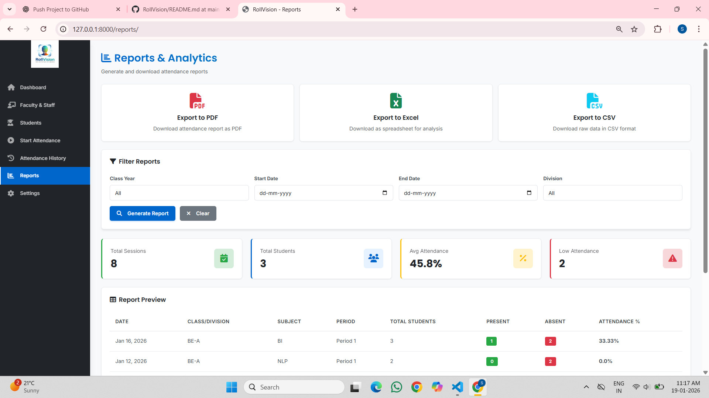
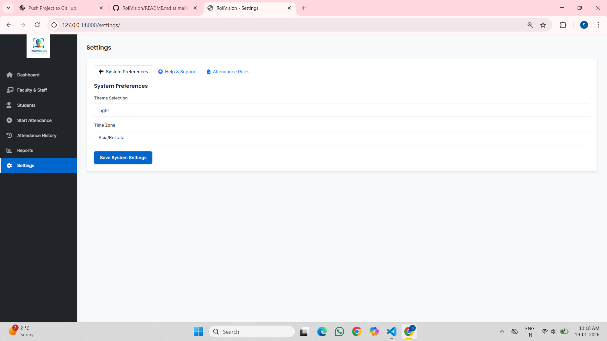

# RollVision
AI-Powered Automated Attendance Marking System.
RollVision is a Django-based web application developed as an academic project to understand backend development, environment-based configuration, and version control using Git and GitHub. The project follows clean architecture principles and is structured for scalability.

## 📷 Screenshots
### Dashboard

### Faculty

### Student

### Register

### Attendance

### Attendance History

### Reports

### Settings

###
